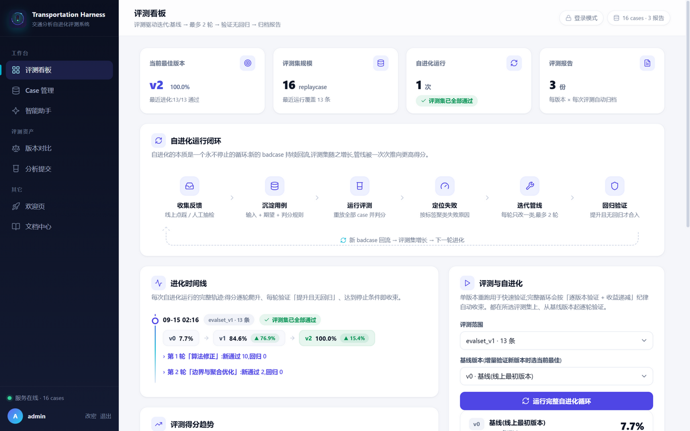
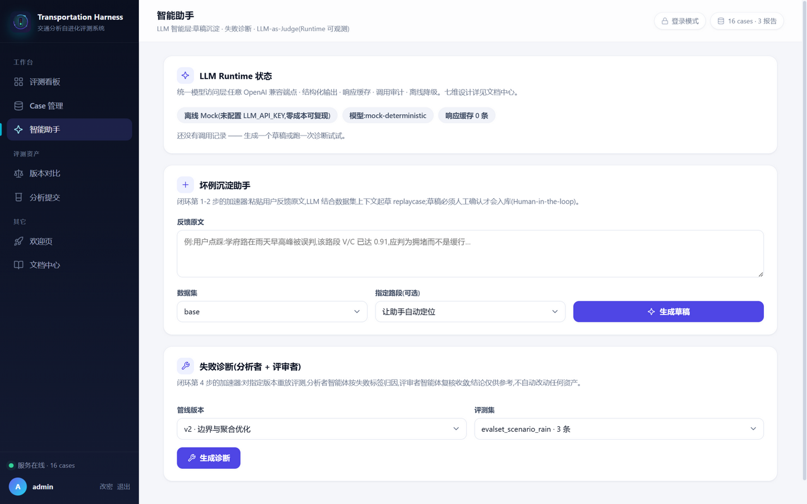
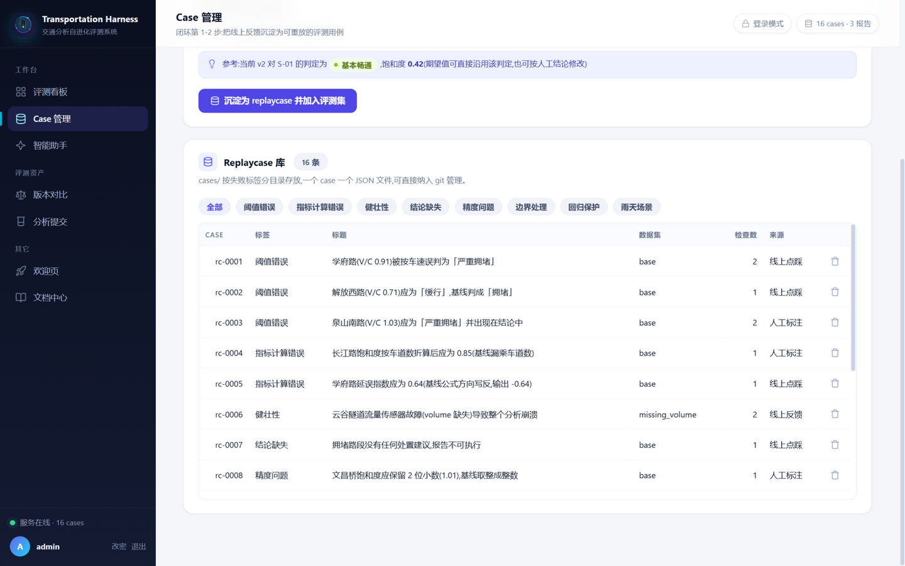
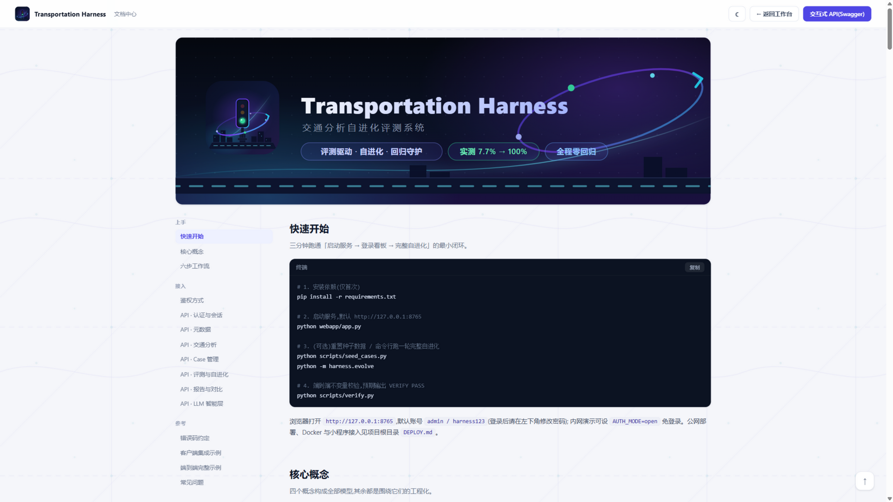
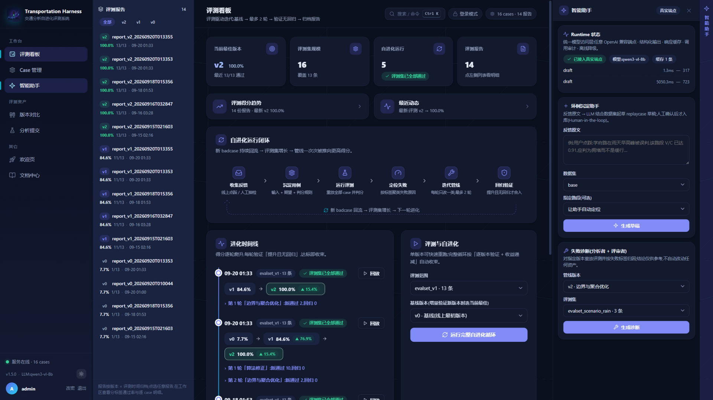
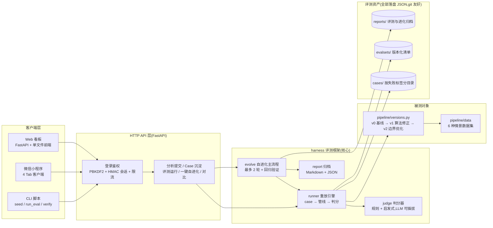

# Transportation Harness — 交通分析自进化评测系统

[](.github/workflows/ci.yml)

**一句话定位**:把大模型时代「评测驱动迭代」的工程方法论,落地到交通分析领域 ——
线上 badcase 沉淀为可重放的 replaycase,组成版本化评测集,用
**「评测 → 定位失败 → 迭代 → 回归验证」** 的闭环驱动分析管线持续进化,
实测将管线得分从 **7.7% 提升到 100%**。配套 PWA 网页看板与微信小程序双客户端,
并提供官方 Python SDK 与 OpenAPI 规范供程序化接入。

这个 harness 框架本身与「交通」无关:换成代码评审、医疗问答、客服话术,闭环同样成立 ——
这正是它的应用前景所在。在此之上,项目按 **Runtime / Context & Memory / Tool & Workflow /
Human-in-the-loop / Multi-Agent / Evaluation & Governance / 工程化落地** 七个维度
完成了克制而有价值的 LLM 集成(详见 [docs/LLM.md](docs/LLM.md)):LLM 只接在闭环的薄弱环节上 ——
坏例沉淀助手、LLM-as-Judge、失败诊断(分析者+评审者双智能体),全部带 Schema 校验、
人工确认与调用审计;未配置 Key 自动降级为确定性 Mock,**离线可复现、零成本、CI 免密钥**。

## 界面一览

| 评测看板(双栏:时间线 + 趋势图 / 评测操作 + 版本卡片) | 智能助手(LLM 层) |
| --- | --- |
|  |  |
| **Case 管理** | **文档中心(/help)** |
|  |  |

**深色模式**:侧边栏一键切换、偏好持久化、文档中心自动跟随;趋势图悬停显示逐报告详情。



## PWA:可安装、可离线

网页已按渐进式应用标准升级,在 **localhost 或 HTTPS 环境**下:

- **安装到设备**:浏览器地址栏「安装」或侧边栏 ⤓ 按钮 → 获得独立窗口、带图标的
  类原生应用(桌面 / Android 主屏;maskable 图标适配 Android 自适应蒙版);
- **离线可用**:Service Worker 预缓存应用壳(`/` 与 `/help`),GET 类 API 数据
  network-first + 缓存回退 —— 断网时仍可浏览最后一次加载的看板数据,恢复联网自动更新;
- **更新机制**:SW 版本化缓存 + skipWaiting,新版本就绪时页面内提示「刷新生效」;
- **安全上下文约束**(浏览器强制):公网 http IP 访问时 SW 自动不注册,页面功能不受影响;
  域名 + HTTPS(已预置 Nginx + certbot)后全量生效 —— 部署切换见 [DEPLOY.md](DEPLOY.md)。

图标资产由 `scripts/generate_pwa_icons.py` 从 SVG 母版栅格化(resvg),改图标后重跑即可。

## 为什么需要它

线上算法系统最痛的不是「写出 v1」,而是:

- **改好一处、改坏三处**:没有回归防护,没人敢动老代码;
- **badcase 白白流失**:用户反馈散落在群聊截图里,下个版本照样栽在同一坑里;
- **迭代全凭感觉**:新版本好不好,没有数字,只有「我觉得还行」。

Transportation Harness 用一套可重放、可版本化、可自动判分的评测资产回答这三件事,
并把迭代纪律固化为代码:**基线测量 → 每轮只改一类问题 → 提升且无回归才合入,收益 <5% 即停(收益递减),全程最多 2 轮**。

## 系统架构



## 核心工作流(六步闭环)

每一步都有页面/命令承接,新人 10 分钟能走通全流程:

| 步骤 | 动作 | 入口 |
| --- | --- | --- |
| 1️⃣ 收集反馈 | 线上点踩 / 人工抽检发现坏结果 | 现实渠道 |
| 2️⃣ 沉淀 case | 输入 + 期望结论 + 判分规则 → `cases/<标签>/rc-xxxx.json`,自动入评测集 | 看板「Case 管理」或 `POST /api/cases` |
| 3️⃣ 运行评测 | 批量重放全部 case,判分汇总 | `python -m harness.evolve` 或看板「运行评测」 |
| 4️⃣ 定位失败 | 失败按标签聚类(阈值错误/健壮性/精度…) | 看板「评测看板」分标签通过率 |
| 5️⃣ 迭代管线 | 在 `pipeline/versions.py` 新增 v3,每轮只改一类问题 | 一处登记,报告看板自动更新 |
| 6️⃣ 回归验证 | 逐 case 差分:新通过 vs 回归,通过才合入 | 看板「版本对比」+ `scripts/verify.py` |

闭环回到第 1 步:新的 badcase 持续回流,评测集随之增长,管线被一次次推向更高得分。

## 目标人群与应用场景

| 人群 | 用它做什么 | 对应能力 |
| --- | --- | --- |
| **算法/LLM 工程师** | 把「评测集管理 + 回归验证」方法论迁移到任意算法管线;接入真实 LLM-as-judge 给生成文本打分 | `BaseJudge` 可插拔接口、版本对比、进化时间线 |
| **交管/交通规划业务方** | 每日路网体检:把卡口/互联网路况整理成 JSON 放入 `pipeline/data/`,得到当日分析 + 与历史 case 的回归对比;信号配时优化前后各评一次,量化改善 | 情景数据集、分析提交、版本对比 |
| **高校师生** | 《交通设计与管理》等课程实验平台:学生分析脚本接同一评测集横向打分;毕设用它管理 baseline 迭代,进化时间线即实验记录 | CLI 评测、Markdown 归档报告 |
| **竞赛/建模选手** | 答辩现场改参数、跑评测、展示 7.7% → 100% 的进化过程,比贴截图有说服力 | 一键自进化、看板可视化 |
| **一线巡查员(外业)** | 用微信小程序在现场提交可疑分析结果(选路段/设期望)→ 自动沉淀为 replaycase → 回办公室跑自进化,「外业发现、内业进化」 | 小程序 Case 库、X-API-Token 机器鉴权 |

**数据源升级路径**:手工 JSON → CSV 批量导入 → 卡口/GPS 实时接入(FastAPI 加一个 ingest 端点)→
公开数据集(CitySim、Apollo、杭州/深圳公开路况)。管线零改动,数据即场景 —— 情景一律建模在
数据集参数里(容量/流量/车速),这正是 harness 与被测对象解耦的价值。

## 内置情景数据集(「分析提交」页可直接体验)

| 数据集 | 情景 | 建模方式 | 考察点 |
| --- | --- | --- | --- |
| `base` | 常规早高峰 | 基准快照 | 标定其它情景的对比基线 |
| `rain_peak` | 雨天早高峰 | 通行能力 ×0.85、车速普降 | 恶劣天气下的分级灵敏度与预警 |
| `incident` | 突发事故占道 | S-03 车道 6→5、车流转移 | 事件影响定位与处置建议可执行性 |
| `evening_peak` | 晚高峰通勤 | 潮汐方向反转、流量重分布 | 方向性流量变化下的表达力 |
| `missing_volume` / `empty` | 数据质量异常 | 传感器缺失 / 空输入 | 健壮性与优雅降级 |

配套 `evalset_scenario_rain`(雨天 3 条)演示「同一管线 × 多评测集」的场景化评测:

```bash
python scripts/run_eval.py --version v2 --evalset evalset_scenario_rain
```

## 快速开始

```bash
pip install -r requirements.txt          # fastapi + uvicorn
python scripts/seed_cases.py             # (可选)重置种子 replaycase 与评测集
python scripts/seed_scenario_cases.py    # (可选)重置雨天场景评测集
python -m harness.evolve                 # 跑自进化循环:v0 → v1 → v2,归档报告
python scripts/verify.py                 # 端到端不变量校验,预期 VERIFY PASS
python webapp/app.py                     # 启动看板 → http://127.0.0.1:8765
```

**账号**:首次启动自动创建 `webapp/auth.json`(已被 .gitignore 排除,不入库),默认
**admin / harness123**(可用环境变量 `ADMIN_USER` / `ADMIN_PASSWORD` 覆盖);登录后可在侧边栏修改密码。
内网演示想免登录,启动时设 `AUTH_MODE=open`;机器客户端(小程序/脚本)配
`AUTH_TOKEN=<串>` 后以 `X-API-Token` 请求头访问。

### 当前部署状态(2026-09 公网版)

- **公网 ECS**:阿里云杭州 `47.114.37.174`(Ubuntu 26.04,2C4G,Docker 29 + Compose V2),
  容器 `transportation-harness` 常驻 `/opt/harness`(compose 托管,自动重启);
  安全组已放行 TCP 8765,`/api/health` 公网可达;
- **小程序 AppID**:`wx5455bfec9b610cd7`(个人主体,已写入 `miniprogram/project.config.json`),
  开发者工具登录后点"预览"即可真机调试;
- **小程序 API 地址**:`http://47.114.37.174:8765`(公网,手机任意网络可用;
  备案域名 + HTTPS 就绪后替换,以满足正式发布要求);
- **机器客户端令牌**:`harness-mp-2026`(小程序 `config.js` 的 TOKEN 与服务器 `.env` 的
  `AUTH_TOKEN` 保持一致);
- **服务器运维**:`ssh root@47.114.37.174`(公钥免密);日志 `docker logs transportation-harness`;
  更新部署 = 本机打包 scp + 解压覆盖 + `docker compose up -d --build`;
- **手机首次进入**:小程序右上角"…" → 打开调试(放行 http 请求);
- **局域网备选**:本机 `python webapp/app.py`(桌面 `启动后端.bat`)仍可离线开发,
  小程序地址切回 `http://192.168.0.110:8765` 即可。

公网/小程序:

```bash
AUTH_MODE=login AUTH_TOKEN=<强随机串> HOST=0.0.0.0 python webapp/app.py
docker compose up -d --build                              # 或容器化部署
```

其它常用命令:

```bash
python scripts/run_eval.py --version v1 --md              # 单版本评测并输出 Markdown
python scripts/verify.py --evalset evalset_scenario_rain  # 校验指定评测集
pytest                                                    # 单元/接口测试(144 个)
ruff check .                                              # 静态检查
```

> 公网部署三条路线(内网穿透 / 云服务器 Docker+Nginx+HTTPS / Render·Fly.io)与
> 微信小程序发布清单见 [DEPLOY.md](DEPLOY.md);小程序配置见 [miniprogram/README.md](miniprogram/README.md);
> 设计决策与扩展点见 [ARCHITECTURE.md](ARCHITECTURE.md);完整 API 参考见 [docs/API.md](docs/API.md)。

## 自进化实测结果

| 版本 | 说明 | 得分 | 备注 |
| --- | --- | --- | --- |
| v0 | 基线(按车速分级、公式有误、缺数据崩溃) | 1/13(7.7%) | 唯一通过:回归保护用例 |
| v1 | 算法修正:V/C 五级分级、公式修正、缺失数据降级、生成建议 | 11/13(84.6%) | 无回归,+76.9% |
| v2 | 边界升级规则、全局指数流量加权、空数据防御 | **13/13(100%)** | 无回归,+15.4% |

逐轮轨迹、分标签通过率与逐 case 差分见 `reports/` 下最新一份
`report_evolution_*.md`(每次运行 `python -m harness.evolve` 自动归档)。

## 质量保障

- **144 个 pytest 用例**:models 序列化往返、storage 路径安全与清单一致性、judge 全部规则语义、
  runner 崩溃捕获、report 差分与渲染、evolve 完整闭环、管线三版本算法行为、
  auth 口令哈希/限流/令牌、Web API 鉴权与全端点、LLM 层(Runtime 缓存审计/judge/双工作流/
  幻觉过滤/Human-in-the-loop 全链路)、PWA(manifest/SW 预缓存与离线回退)、
  Python SDK(强类型返回/命令行/全端点)—— 测试用临时目录隔离,不污染真实评测资产,CI 免密钥;
- **ruff** 静态检查全绿(B/UP/SIM/C4/I 规则集);
- **GitHub Actions CI**:Python 3.11/3.12 矩阵,lint + pytest + 端到端校验;
- **端到端不变量校验**(`scripts/verify.py`):种子 case 行为冻结 + 通过集单调不减(无回归)+
  关键数值抽查;评测集增长后依然可用,新沉淀未修复的 case 降级为 WARN。

## LLM 智能层(概览)

按「七维」落地的克制集成,完整设计见 [docs/LLM.md](docs/LLM.md):

- **Runtime**:`llm/runtime.py` —— 任意 OpenAI 兼容端点(零 SDK 依赖)、强制 JSON 输出、
  超时重试、响应缓存、调用审计(`llm_runs.jsonl`);未配置 `LLM_API_KEY` 自动降级
  确定性 Mock,离线可复现;
- **LLM-as-Judge**:`conclusion_quality` 检查类型按评分细则(覆盖性/可执行性/简洁性)
  给结论文本打分,分数与理由随报告持久化可复核,故障降级为"未通过+原因可见";
- **坏例沉淀助手**:反馈原文 → 结构化草稿,**人工确认**才入库(与手工沉淀同一校验路径);
- **失败诊断**:分析者 + 评审者双智能体流水线,case_id 防幻觉过滤,结论仅供参考;
- **治理**:模型输出全过校验、一切调用可审计、成本可见(缓存命中/token)、三条
  Human-in-the-loop 硬边界。

配置(可选,三个环境变量):`LLM_BASE_URL` / `LLM_API_KEY` / `LLM_MODEL`,
示例见 [.env.example](.env.example);看板「智能助手」页可实时查看 Runtime 状态与调用审计。

## Web API

鉴权:`AUTH_MODE=login`(默认)时,除 `/api/auth/*` 与 `/api/health` 外的接口需要
登录会话(HttpOnly Cookie);设置 `AUTH_TOKEN` 后机器客户端可用 `X-API-Token` 头;
`AUTH_MODE=open` 全部放行(仅内网演示)。

**文档体系**:运行实例内置「文档中心」`/help`(核心概念 / 工作流 / 全量接口参考 / 错误码 /
客户端集成示例,与网页同风格,无需登录),`/docs` 为交互式 OpenAPI 调试页;
仓库内的人读参考是 [docs/API.md](docs/API.md) —— 三者内容同构。
**平台化接入**:机器可读规范 [docs/openapi.json](docs/openapi.json)(OpenAPI 3.1,可导入
Postman/Apifox)、[docs/INTEGRATION.md](docs/INTEGRATION.md)(《5 分钟接入指南》)、
官方 Python SDK [sdk/](sdk/)(`pip install ./sdk`,导入名 `harness_client`,自带
`harness-client` 命令行)。

| 方法 | 路径 | 说明 |
| --- | --- | --- |
| POST | `/api/auth/login` / `/api/auth/logout` | 登录(种 Cookie)/ 登出;连续失败 5 次锁定 10 分钟 |
| GET | `/api/auth/me` | 当前登录用户 |
| POST | `/api/auth/password` | 修改密码(旧密码校验 + 会话续签) |
| GET | `/api/health` | 健康检查(鉴权模式、默认口令状态、case/评测集/报告数量) |
| GET | `/api/versions` | 管线版本与 CHANGELOG |
| GET | `/api/datasets` | 情景数据集列表(含场景解读) |
| GET | `/api/segments/{dataset}` | 数据集内路段列表(供下拉选择) |
| POST | `/api/analyze` | 提交分析 `{version, dataset_name}` |
| GET/POST | `/api/cases` | 列出 / 沉淀 replaycase(带完整输入校验) |
| DELETE | `/api/cases/{id}` | 删除 case,并同步从所有评测集清单移除 |
| POST | `/api/cases/batch-delete` | 批量删除(单锁同步评测集清单,单次 ≤200) |
| GET | `/api/evalsets` | 评测集清单列表(含规模) |
| GET | `/api/activity` | 最近动态:case/评测/自进化/LLM 草稿统一时间流 |
| POST | `/api/eval/run` | 运行评测 `{version, evalset}` 并归档报告 |
| POST | `/api/evolve/run` | **一键自进化** `{evalset?, baseline?}`(基线 → 逐登记版本验证 → 归档,返回逐轮摘要) |
| GET | `/api/reports` / `/api/reports/{id}` | 报告列表 / 详情 |
| GET | `/api/evolutions` / `/api/evolutions/{id}` | 自进化运行记录(时间线) |
| GET | `/api/compare?a=&b=` | 两份报告逐 case 差分(含 checks 级明细 diff) |
| GET | `/api/cases/{id}` | 单条 replaycase 详情(含判分规则) |
| GET | `/api/llm/status` | LLM Runtime 状态(供应方/模型/缓存/调用审计) |
| POST | `/api/llm/drafts` | 坏例沉淀助手:反馈原文 → replaycase 草稿(待人工确认) |
| GET | `/api/llm/drafts` | 草稿列表 |
| POST | `/api/llm/drafts/{id}/confirm` | 人工确认草稿 → 正式 replaycase(与手工沉淀同一校验路径) |
| DELETE | `/api/llm/drafts/{id}` | 丢弃草稿 |
| POST | `/api/llm/diagnose` | 失败诊断(分析者 + 评审者双智能体,仅供参考) |

## 目录结构

```
Transportation_Harnesss/
├── pipeline/
│   ├── versions.py        # 被测管线 v0(基线)/v1/v2(两轮迭代)+ CHANGELOG
│   └── data/              # 情景数据集(常规早高峰/雨天/事故占道/晚高峰/缺失数据/空数据)
├── harness/               # 评测框架(与"交通"领域解耦,可整体迁移)
│   ├── models.py          # ReplayCase / CaseResult / EvalResult 数据结构
│   ├── storage.py         # cases/、evalsets/、reports/ 读写(原子写入 + 加锁 + 路径安全)
│   ├── judge.py           # 规则 judge + 启发式 judge + LLM-as-Judge(可插拔)
│   ├── runner.py          # 重放引擎:批量重放 case → judge → EvalResult
│   ├── report.py          # Markdown/JSON 报告(code-optimization 模板)
│   └── evolve.py          # 自进化主流程(最多 2 轮;run_evolution() 供 API 调用)
├── llm/                   # LLM 智能层(七维设计见 docs/LLM.md)
│   ├── runtime.py         # Runtime:OpenAI 兼容端点/缓存/审计/离线 Mock 降级
│   ├── judge.py           # LLM-as-Judge:conclusion_quality 评分细则判分
│   ├── workflows.py       # 工作流:坏例草稿沉淀 + 失败诊断(分析者+评审者)
│   ├── store.py           # 治理设施:响应缓存/调用审计日志/草稿存储
│   └── mocks.py           # 离线确定性 Mock(不配 Key 时零成本可复现)
├── cases/                 # replaycase 库,按失败标签分目录(13 条种子 + 3 条雨天场景)
├── evalsets/              # 版本化评测集清单(evalset_v1 / evalset_scenario_rain)
├── reports/               # 评测报告(JSON 每版本一份 + 自进化记录 evolution_*.json + Markdown 总报告)
├── scripts/
│   ├── seed_cases.py      # 沉淀首批 replaycase + 生成评测集清单
│   ├── seed_scenario_cases.py  # 沉淀雨天场景评测集
│   ├── run_eval.py        # 单版本评测 CLI
│   ├── verify.py          # 端到端不变量校验(对评测集增长鲁棒)
│   ├── backup.py          # 评测资产一键打包备份(cases/evalsets/reports)
│   ├── export_openapi.py  # 导出机器可读 API 规范 → docs/openapi.json
│   └── generate_pwa_icons.py   # SVG 母版栅格化 PWA 图标(resvg)
├── webapp/
│   ├── app.py             # FastAPI 后端(登录鉴权/校验/一键自进化)
│   ├── auth.py            # 本地账号与会话(PBKDF2 口令哈希 + HMAC 令牌 + 登录限流)
│   └── static/
│       ├── index.html     # 欢迎页 + 登录页 + 应用壳(单文件,无外部依赖)
│       ├── help.html      # 文档中心(核心概念/工作流/全量 API 参考,/help 访问)
│       ├── sw.js          # Service Worker(壳预缓存/SWR 静态/API network-first)
│       └── manifest.webmanifest + assets/   # PWA 清单与图标四件套
├── docs/
│   ├── API.md             # API 参考手册(仓库版,与 /help 内容同构)
│   ├── INTEGRATION.md     # 5 分钟接入指南(cURL → SDK → 原生 HTTP)
│   ├── LLM.md             # LLM 智能层七维设计
│   └── openapi.json       # OpenAPI 3.1 机器可读规范(28 路径,可导入 Postman/Apifox)
├── sdk/                   # 官方 Python SDK(pip install ./sdk,导入名 harness_client)
├── miniprogram/           # 微信小程序客户端(评测看板/分析提交/Case 库/版本对比)
├── tests/                 # 144 个 pytest 用例(单元 + 接口 + 闭环 + LLM + PWA + SDK;夹具用冻结种子快照)
├── .github/workflows/ci.yml  # CI:ruff + pytest + verify(Python 3.11/3.12 矩阵)
├── Dockerfile             # 容器化(非 root 运行 + 健康检查;数据卷挂载,升级不丢评测资产)
├── docker-compose.yml
├── DEPLOY.md              # 公网部署三条路线 + 小程序发布清单
└── ARCHITECTURE.md        # 架构分层、关键设计决策与扩展点
```

## replaycase 数据结构

```jsonc
{
  "case_id": "rc-0001",
  "title": "学府路(V/C 0.91)被按车速误判为「严重拥堵」",
  "label": "阈值错误",              // 失败类别,用于聚类分析
  "source": "线上点踩",             // 反馈来源
  "dataset_name": "base",           // 复现所需数据集(pipeline/data/)
  "checks": [                       // 判分规则,交给 judge 执行
    {"type": "classify", "segment": "S-02", "expected": "拥堵"},
    {"type": "metric", "segment": "S-02", "field": "saturation", "expected": 0.91, "tol": 0.01}
  ],
  "notes": "..."
}
```

支持的检查类型:`classify`(拥堵等级)、`metric`(指标近似,支持全局字段)、
`no_crash`(健壮性)、`recommendations`(建议完备性)、`congested_empty`(空数据降级)、
`conclusion_keyword`(结论关键词,由启发式 judge 执行)。

## 接入真实 LLM judge

`harness/judge.py` 中 `HeuristicJudge` 是离线确定性的 LLM-judge 替身。
接入真实大模型时,继承 `BaseJudge` 实现打分逻辑,替换 `CompositeJudge` 成员即可,
runner 与报告无需改动 —— 评测框架与判分实现解耦,与「被测管线与 harness 解耦」是同一个思想。

## 演进路线图

1. **数据源**:CSV 批量导入 → 卡口/GPS 实时 ingest 端点 → 公开数据集接入;
2. **判分**:接入真实 LLM-as-judge 给结论文本打分 → 人工复核抽样校准 judge 本身;
3. **规模**:评测集版本 diff 视图、case 去重建议(相似输入聚类);
4. **协同**:多账号与角色(标注员/审核员)、case 审核流;
5. **迁移**:抽出 `harness/` 为通用「badcase → 评测集 → 自进化」框架,交通只是第一个领域。
