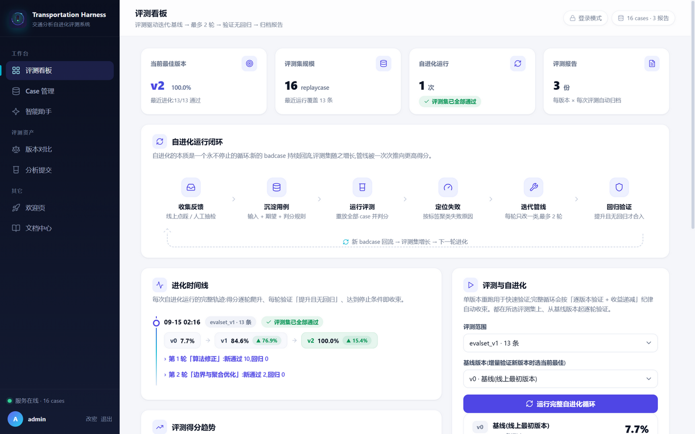
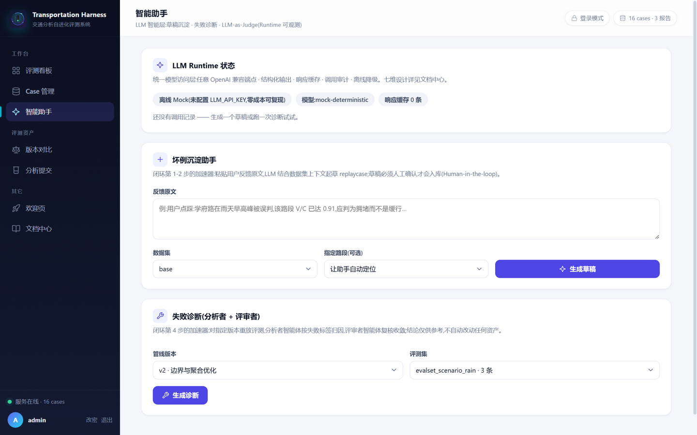

<div align="center">


# Transportation Harness

**交通分析自进化评测系统** —— 把线上 badcase 沉淀成可重放用例,
让算法的每一次迭代都必须通过「提升且无回归」的门禁才算数。

[](https://github.com/Luz7818/Transportation_Harnesss/actions/workflows/ci.yml)
[](https://github.com/Luz7818/Transportation_Harnesss/actions/workflows/probe.yml)


[快速开始](#快速开始) · [能力总览](#能力总览) · [架构](#架构) · [安全模型](#安全模型) · [部署](docs/DEPLOY.md) · [Roadmap](#roadmap)

</div>

> 用途：给第一次打开这个仓库的人。看完知道它是什么、能不能解决你的问题、怎么在离线环境里跑起来。
> 事实与约束的单一来源是 [AGENTS.md](AGENTS.md);逐端点参考在 [docs/API.md](docs/API.md)。

## 为什么需要它

线上分析系统最贵的三件事:**badcase 散在聊天记录里没人认领**、**改好一处改坏三处**、
**新版本好不好全靠嘴说**。本项目把这三件事变成可执行、可复核的闭环:

```
用户反馈 ──沉淀──> replaycase ──汇总──> 版本化评测集 ──重放──> 逐条判分
                                                        │
        看板时间线回放 <──归档报告 <──「提升且无回归」门禁 <──┘
```

一条反馈就是一个可重放的评测用例;算法每次迭代跑一遍评测集,
出现回归就一票否决,单轮收益 <5% 自动止损,最多两轮、不静默丢弃待验证版本。

**评测框架 `harness/` 与「交通」无关**:被测对象只要满足 `analyze(segments) -> dict`
并登记进版本表即可,换成任何分析领域闭环同样成立。LLM 只接在闭环的薄弱环节
(反馈起草用例、结论文本打分、失败诊断),不配密钥全程走离线确定性 Mock。

## 快速开始

```bash
pip install -r requirements.txt

# Windows cmd;PowerShell 用 $env:AUTH_MODE="open";Linux/macOS 用 AUTH_MODE=open python webapp/app.py
set AUTH_MODE=open && python webapp/app.py
```

浏览器打开 <http://127.0.0.1:8765>。不启动服务也能跑完整闭环(纯命令行,同样离线):

```bash
python scripts/run_eval.py --version v0      # 看基线错在哪
python -m harness.evolve                     # 基线 → 逐版本验证 → 归档报告
python scripts/verify.py                     # 端到端不变量校验,预期 VERIFY PASS
```

完整步骤(含真实报错与处理办法)见 [docs/GET-START.md](docs/GET-START.md);
公网部署、凭据生成与线上探针见 [DEPLOY.md](docs/DEPLOY.md)。

## 实测战绩

下表全部由仓库自带资产重放得到,归档在 `reports/`,可随时复核
(`python scripts/run_eval.py --version v0` 等逐版本重算):

| 版本 | 这一轮改了什么 | 得分 | 回归 |
| --- | --- | --- | --- |
| v0 | 基线:按车速分四档、饱和度漏乘车道数、延误公式方向反、缺数据即崩 | 1/13(7.7%) | — |
| v1 | 分级改看 V/C 五级、公式修正、缺失数据降级、生成处置建议 | 11/13(84.6%) | 0 条 |
| v2 | 边界升级、全局指数按流量加权、空数据防御 | 13/13(100%) | 0 条 |
| v3 | 排队回溢升级带:V/C∈[0.70,0.8) 且速度比<0.50 升级「拥堵」 | 15/15(100%)¹ | 0 条 |

¹ v3 由新沉淀的 rc-0014/rc-0015(晚高峰排队回溢外业复核)驱动:同一评测集 v2 13/15 → v3 15/15
(复核:`python -m harness.evolve --baseline v2`);雨天集 v3 保持 3/3(复核:verify.py --evalset evalset_scenario_rain)。

## 能力总览

| 入口 | 做什么 | 上手命令 |
| --- | --- | --- |
| 🧪 跑评测 | 重放整个评测集、逐条判分、归档报告 | `python scripts/run_eval.py --version v2` |
| 🔁 一键自进化 | 基线测量 → 逐版本验证 → 回归检查 → 归档 | `python -m harness.evolve` |
| 📥 沉淀 badcase | 反馈 → 可重放用例,自动进评测集 | 看板「Case 管理」或 `POST /api/cases` |
| 📊 看板(PWA) | 得分趋势、进化时间线回放、逐用例差分 | 浏览器打开 `/`,文档中心 `/help` |
| 📱 微信小程序 | 外业现场提交 badcase、手机回看结果 | 微信开发者工具导入 `miniprogram/` |
| 🐍 Python SDK / CLI | 程序化调用、CI 里守回归 | `pip install ./sdk` → `harness-client eval --version v2` |
| 🤖 LLM 智能层 | 草稿助手、LLM-as-Judge、失败诊断双智能体 | 见 [docs/LLM.md](docs/LLM.md),全部可降级 |

界面(三栏布局可拖拽,深色模式,支持安装为 PWA):

| 评测看板 | 智能助手面板 |
| --- | --- |
|  |  |

## 架构

```
┌─────────────────────────────────────────────────────────────┐
│  客户端:webapp/static(PWA 看板)· miniprogram · scripts · SDK │
├─────────────────────────────────────────────────────────────┤
│  HTTP API 层:webapp/app.py(FastAPI)+ auth.py + settings.py │
├──────────────────────────────┬──────────────────────────────┤
│  harness/(评测框架,领域无关) │  llm/(LLM 智能层,可选可降级) │
├──────────────────────────────┴──────────────────────────────┤
│  被测对象:pipeline/versions.py(v0 → … → v3)+ 6 情景数据集    │
├─────────────────────────────────────────────────────────────┤
│  评测资产(全量落盘 JSON,git 友好):cases · evalsets · reports │
└─────────────────────────────────────────────────────────────┘
```

三条分层硬约束:`harness/` 不 import `pipeline/`/`llm/`/`webapp/`(框架可迁移);
`llm/` 是增强层不是依赖层(任何 LLM 功能失败都有确定性降级路径);
客户端只走 HTTP API,不 import 后端模块。设计理由详见 [ARCHITECTURE.md](docs/ARCHITECTURE.md)。

## 安全模型

- **账密必须由部署者自己提供**:启动环境设 `ADMIN_PASSWORD` 即视为已设置
  (`default_credentials=false`);未提供时随机生成一枚只打印一次 —— 并且在口令被改掉之前,
  **业务接口对三种凭据一律 403**,只开放登录与改密。「忘了改口令」不可能静默存活;
- 机器令牌 `AUTH_TOKEN` 短于 16 字符时服务拒绝启动;小程序走「登录换会话令牌」,
  不存在静态令牌;口令 PBKDF2 存储 + 登录限流 + 会话 HMAC 签名;
- 未处理异常只回显通用提示,细节进服务端日志;文件名全部过白名单防路径穿越;
- CI 自带发布一致性断言(版本四处同步 + OpenAPI 无漂移);GitHub Actions 每天只读探针
  守护线上部署的「在线 + 初始口令已改」状态。

## Roadmap

- [ ] **2.0 真实数据接入**:换掉合成快照(公开轨迹集或外业采集),数据集记录 `source`/`captured_at`;当前快照仍为合成口径
- [x] **2.1 前向迭代留痕**:rc-0014/rc-0015 沉淀 → evolve → v3 归档(2.0.0)
- [x] **2.2 交付形态收口**:单实例约束写明(docs/DEPLOY.md),`--baseline` 末端版本明确 400(1.6.0)
- [x] **2.3 真实模型判分**:qwen3.8-27b 判分归档,Mock 1.0 vs 真实 0.70(见 [docs/LLM.md](docs/LLM.md))
- [ ] **2.4 线上化**:HTTPS + 备案域名,小程序正式发布(或明确定位为内网演示端)
- [ ] **发布**:tag + GitHub Release 附 SDK wheel;版本一致性断言已进 CI(1.6.0)

## 已知局限

1. **版本只有三个,且都是"事后重写"的样例**。harness 只负责验证与守回归,不会自动生成新版本。
2. **建议文案的可执行性是真实短板**:rc-0015 引入 `conclusion_quality` 后,真实模型
   (qwen3.8-27b)判 0.70 恰在阈值(「建议模板化、缺少具体分流路径」),Mock 判 1.0 掩盖了它
   (对比见 [docs/LLM.md](docs/LLM.md))。
3. **交通数据是合成快照**(`captured_at` 2026-08-31),未接卡口/GPS 实时源。
4. **单进程文件存储**:并发靠进程内锁,多实例部署锁不跨进程(部署约束见 DEPLOY.md)。
5. **小程序正式发布有硬门槛**:必须 HTTPS + 已备案域名,当前默认部署只适合开发与内网。

## 贡献

欢迎 issue 与 PR,动手前请先读 [AGENTS.md](AGENTS.md)(事实与约束的单一来源)。改动需过
`ruff check .` + `python -m pytest` + `verify.py` + `check_release.py` 四条门禁;端点改动需重导
OpenAPI 并同步 `docs/API.md` 与 `webapp/static/help.html`;文档遵循工作区《文档标准》。

## 环境要求

Python 3.11+。运行时依赖只有 `fastapi` 与 `uvicorn`,开发/测试另需 `pytest`、`httpx`、`ruff`、`Pillow`
(复核:`cat requirements.txt requirements-dev.txt`)。默认全程离线:不需要网络、不需要模型密钥。

## 许可

MIT([LICENSE](LICENSE))。

---

<p align="center"><sub>评测资产(用例 / 评测集 / 报告)即项目记忆 —— 它们让每一次改进都留得下证据。</sub></p>
